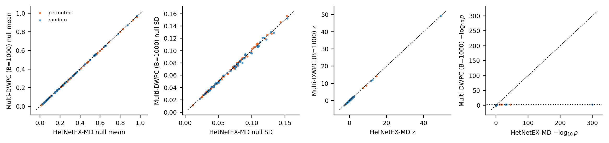
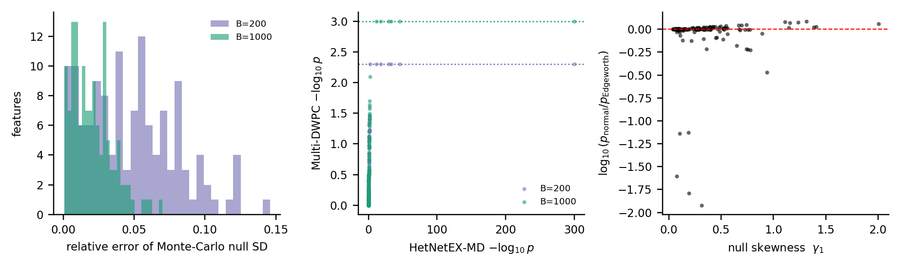
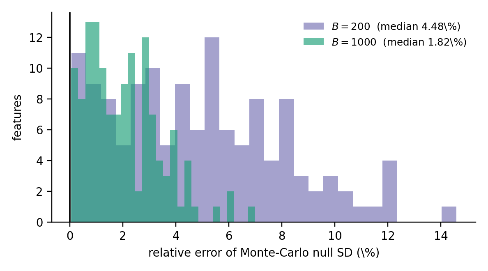
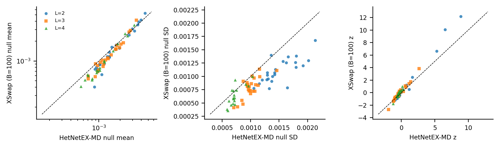
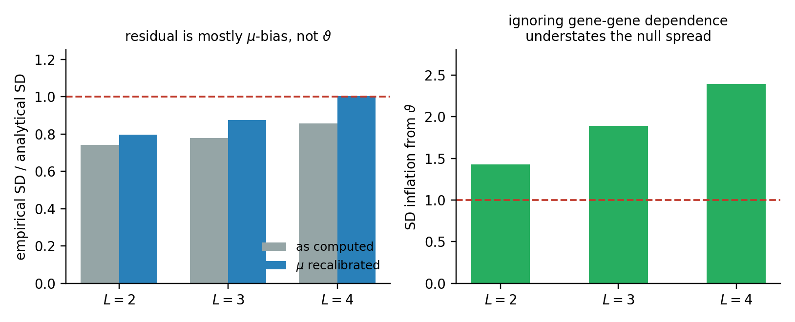
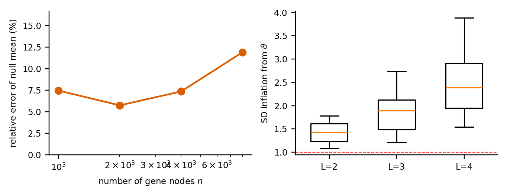
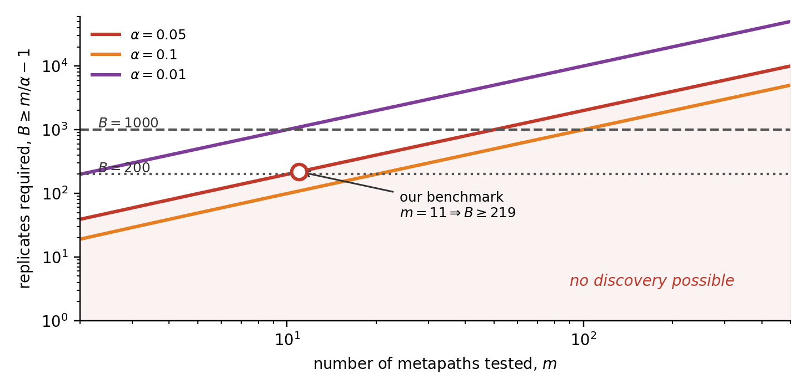

# Results and figures

All measurements below come from synthetic hetnets built to mirror Hetionet's
layer structure. See [theory notes](theory.md) for the statements being tested and
[vignettes](../vignettes/README.md) for runnable versions.

> **Read this first.** The Part I results do **not** depend on the synthetic
> setting — [Lemma 1](theory.md#lemma-1) and [Theorem 5b](theory.md#theorem-5b) are
> identities for any fixed score vector. **Every Part II number does.** Real
> Hetionet benchmarks are the main outstanding task.
>
> **Timings are ratios, not absolutes.** Measured single-threaded in a Linux
> container, and describing the **null stage only** — computing the observed DWPC
> costs the same under both methods.

---

## Benchmark design

| | |
|---|---|
| Node types | Gene 2,000 · Compound 400 · Pathway 250 · Anatomy 150 · Disease 200 · BP 120 |
| Edge types | 13 bipartite, power-law degrees ($\gamma=2.1$), 23,400 edges |
| Metapaths | 11 Gene→BP: four $L{=}2$, four $L{=}3$, three $L{=}4$ |
| Gene sets | 6, sizes $K\in\{40,60,90,120,160,200\}$; signal implanted in three, three left as pure nulls |
| Strata | 10 quantile bins of total degree |
| Damping | $w=0.4$ |
| Features | N1: $11\times6\times2=132$ · N2: $11\times6=66$ |

Interior node types are distinct, so the DWPC equals the degree-weighted walk count
exactly and no self-avoidance correction is needed.

---

## Verification: the exactness claims are identities

Before benchmarking, [Lemma 1](theory.md#lemma-1) and
[Theorem 5b](theory.md#theorem-5b) were verified by **exhaustive enumeration** —
computing the true answer over every admissible sample and comparing.

| Result | Designs tested | Max discrepancy |
|---|---|---|
| Lemma 1 (mean, variance, third moment) | $(N,k)\in\{(9,3),(10,4),(12,5),(11,2),(8,4)\}$ | $<10^{-15}$ |
| Theorem 5b (median tail) | single stratum $(11,5),(12,5),(13,7),(10,5)$; two strata $(7,3){+}(6,2)$, $(8,3){+}(7,4)$ | $2\times10^{-16}$ |

For the symmetric case $N=8,k=4$ both the enumerated and predicted third moments
were zero to within $2\times10^{-18}$. These are covered by the test suite
(`pytest -q`, 31 tests) so they cannot silently regress.

---

## Experiment A — the gene-set resampling null



*Blue = degree-matched random null, orange = pooled permutation null; dashed line =
equality. Left to right: null mean, null SD, effect size $z$, $-\log_{10}p$.*

The first three panels lie on the diagonal. **The scatter around it is
Multi-DWPC's, not ours** — the exact values have no error, so the vertical spread
is a picture of Monte-Carlo noise and the diagonal is the target it converges to.

The fourth panel breaks: points climb the diagonal, then flatten against a ceiling
at $\log_{10}(B{+}1)$. Everything to the right of the detachment is evidence
Multi-DWPC **structurally cannot express**.

| | $B=200$ | $B=1000$ |
|---|---|---|
| Null mean: $r$ / $\rho$ | 0.9998 / 0.9992 | 0.9999 / 0.9995 |
| Null mean: median rel. error | 1.20% | 0.52% |
| Null SD: $r$ / $\rho$ | 0.9922 / 0.9904 | 0.9984 / 0.9971 |
| Null SD: median (max) rel. error | 4.48% (14.6%) | 1.82% (6.99%) |
| Effect size $z$: $r$ / $\rho$ | 0.9996 / 0.9974 | 0.9999 / 0.9992 |
| $-\log_{10}p$: $\rho$ | 0.9723 | 0.9737 |
| Features at the $p$-value floor | 7 of 132 | 6 of 132 |
| **Features with identical $p$** | **0 of 132** | **0 of 132** |
| Wall clock, resampling | 2.96 s | 14.83 s |
| Wall clock, HetNetEX-MD | 0.076 s | 0.076 s |
| **Speed-up** | **38.9×** | **194.9×** |

The Monte-Carlo SD error falls 4.48% → 1.82%, a ratio of 2.46 against the predicted
$\sqrt5=2.24$ — the behaviour of an estimator converging to a fixed target.

### Resolution and the Edgeworth term



**(a)** The Monte-Carlo SD error shrinks as $B^{-1/2}$ but never reaches zero.
**(b)** Both floors marked; points on a dotted line carry evidence $B$ replicates
cannot express. Five times the compute buys less than one order of magnitude of
resolution. **(c)** The Edgeworth correction is systematic in the exact skewness
$\gamma_1$ — and free, because $\gamma_1$ is computed rather than estimated.



*The same convergence viewed as distributions. Median error 4.48% at $B=200$,
1.82% at $B=1000$; maximum 14.6% → 6.99%.*

### The headline result

| FDR 0.05, $m=11$ metapaths | $B=200$ | $B=1000$ |
|---|---|---|
| Bound requires ([Prop 15](theory.md#proposition-15)) | $B\ge219$ | $B\ge219$ |
| HetNetEX-MD selects | 6 | 6 |
| Resampling selects | **0** | 6 |
| Jaccard of selected sets | **0.00** | **1.00** |
| Discordant features | 6 | 0 |

At $B=200$ six features sit at the floor $1/201=0.00498$, but the BH threshold for
the top feature is $0.05/11=0.00455$. The floor cannot reach it.

**The two methods agree completely on the science while disagreeing on every
$p$-value.** The $B=200$ failure is a resolution artefact, not a difference of
opinion.

---

## Experiment A2 — the exact median null

| | |
|---|---|
| Exact median $p$, all 132 features | 0.206 s |
| $B=1000$ median resampling | 26.05 s |
| **Speed-up** | **126×** |
| Informative features | 10 of 132 |
| Rank concordance of $-\log_{10}p$ (informative) | $\rho=0.874$ |
| Features at the resampling floor | 6 of 10 |
| Smallest exact $p$ | $\sim10^{-44}$ |

Only 10 of 132 features were informative: for the other 122 the observed median was
**exactly zero**, because on a sparse metapath more than half a typical gene set has
no path to the target. The degeneracy is a property of the median aggregate on
sparse data, not of the method, and argues for the mean aggregate on scientific
grounds.

---

## Experiment B — the network-permutation null



*Null mean (log axes), null SD, and effect size $z$, by path length. Figure
predates the max-entropy correction; rankings are unchanged by it.*

### The Monte-Carlo noise floor of the reference

Before attributing error to the theory, bound the error in the yardstick. With
$B=100$ and a null coefficient of variation near 0.7, the standard error of the
**empirical** null mean is a median 7.0% of that mean (IQR 4.8–10.2%), implying a
median absolute discrepancy of $0.674\times7.0\%\approx4.7\%$ from sampling alone.

**Any analytical mean within ~5% of the reference is indistinguishable from exact at
this replicate count.**

### The edge-probability model was the dominant error

| $p_{uv}$ model | All | $L=2$ | $L=3$ | $L=4$ |
|---|---|---|---|---|
| sparse limit $d_ud_v/m$ | 22.9% | 16.4% | 23.6% | 30.2% |
| exponential $1-e^{-x}$ ([Lem 4](theory.md#lemma-4)) | 15.5% | 12.7% | 16.2% | 19.1% |
| exact chain (transfer matrix) | 15.4% | 10.9% | 15.6% | 18.6% |
| **max-entropy** ([Lem 4b](theory.md#lemma-4b)) | **4.7%** | **2.6%** | **5.2%** | **4.9%** |
| Bias ratio, max-entropy | **1.004** | 0.987 | 1.028 | 1.008 |
| *MC noise floor of the reference* | *4.7%* | *5.4%* | *4.5%* | *4.8%* |

Degree constraints are met to a median relative residual of $10^{-12}$, so the fit
itself contributes nothing. **The residual now coincides with the noise floor**: the
analytical null mean agrees with XSwap to within XSwap's own sampling error.

| Other quantities | All | $L=2$ | $L=3$ | $L=4$ |
|---|---|---|---|---|
| Effect size $z$: $r$ / $\rho$ | 0.991 / 0.963 | — / 0.982 | — / 0.982 | — / 0.928 |
| Empirical SD / analytical SD | 0.901 | 0.786 | 0.892 | **1.044** |
| after admissibility ([rule](theory.md#admissibility)) | 0.903 | 0.802 | 0.892 | 1.044 |
| Median relative error, SD | 14.9% | 21.4% | 13.1% | 10.5% |
| Empirical SD / independence-only SD | **1.474** | | | |
| SD inflation from $\vartheta$ | 1.68× | 1.43× | 1.89× | 2.39× |
| Wall clock | 55.4 s vs 0.057 s → **967×** | | | |

### The $\vartheta$ story, in two stages



**Stage 1 — I misread my own error.** $\operatorname{Var}(T)$ contains $\vartheta$
only through terms in $\mu_g\mu_h$, so a 15% bias in the *mean* becomes ~30% in the
*variance* before $\vartheta$ is implicated at all. Recomputing the variance with
$\mu$ rescaled to its measured value, leaving $\vartheta$ untouched, moved the ratio
0.773 → 0.884 and the median error 23.0% → 13.6%. **About 41% of the apparent
overshoot was inherited.**

**Stage 2 — fix $\mu$ at source.** The max-entropy probability removes the bias
(ratio 1.004). The SD then lands at 0.903 overall and **1.044 at $L=4$** — exact
where the effect matters most.

**Inter-source dependence is a leading effect.** Assuming genes contribute
independently understates the empirical null SD by a median factor of **1.474**,
rising from 1.43× at $L=2$ to 2.39× at $L=4$. A 200-gene query at $L=4$ treating its
genes as independent understates the null spread by more than a factor of two. This
is a correction to standard practice that holds whether or not the analytical null
is adopted.

---

## Experiment C — finite-size behaviour



Rescaling the network from $n=1{,}000$ to $n=8{,}000$ gene nodes, the relative error
stayed in a 5.8–11.9% band with **no clean monotone trend detectable at $B=50$
replicates**. We report a **bounded residual, not confirmation of an $O(1/n)$
rate**.

In hindsight this experiment measured the wrong thing: the dominant error was the
edge-probability model, not the network size.

---

## Experiment D — two hypotheses tested, both refuted

The analytical SD still overshoots by ~20% at $L=2$. Two explanations were tested.

**H1 — the canonical/microcanonical gap.** XSwap holds degrees *exactly*; the theory
assumes independent edges, i.e. degrees held *in expectation*. Hard constraints
induce a negative edge correlation invisible to the theory. We simulated the
canonical ensemble directly, drawing $B=100$ graphs with independent Bernoulli edges
at the fitted $p_{uv}$.

| null SD ratio | $L=2$ | $L=3$ | $L=4$ |
|---|---|---|---|
| canonical / analytical | 0.819 | 0.893 | 0.960 |
| XSwap / analytical | 0.786 | 0.892 | 1.044 |
| XSwap / canonical | 0.949 | 0.986 | 1.101 |

The two references agree with each other to ~5%, and the formula overshoots
**both**. The ensemble gap is far too small to explain it. **Refuted.**

*(Caveat: the canonical sampler came in 3–5% light on edge counts because it
interpolates from binned degrees. This contaminates the comparison mildly, but not
enough to alter the conclusion.)*

**H2 — double counting in $\operatorname{Var}(Y_g)$.** The
[admissibility rule](theory.md#admissibility) is a genuine correction and is now
applied — but it moved the $L=2$ ratio only 0.786 → 0.802. Right fix, wrong culprit.
**Refuted as the cause.**

The overshoot is therefore concentrated in the cross-source term
$\vartheta_t\{(\sum_g\mu_g)^2-\sum_g\mu_g^2\}$, which carries roughly half the
variance at $L=2$. **The cause is open.** The direction is conservative: an
analytical SD that is too large inflates $p$-values, costing power rather than
creating false positives.

---

## The resolution bound



Benjamini–Hochberg requires $p_{(k)}\le\alpha k/m$; the permutation floor gives
$p_{(k)}\ge1/(B{+}1)$. Together, **no discovery is possible unless
$B\ge m/\alpha-1$** ([Proposition 15](theory.md#proposition-15)).

| metapaths $m$ | $B$ required ($\alpha=0.05$) | $B=200$? | $B=1000$? |
|---|---|---|---|
| 5 | 99 | ok | ok |
| 11 | 219 | **blocked** | ok |
| 25 | 499 | **blocked** | ok |
| 50 | 999 | **blocked** | ok |
| 100 | 1999 | **blocked** | **blocked** |
| 200 | 3999 | **blocked** | **blocked** |
| 500 | 9999 | **blocked** | **blocked** |

With 100 metapaths — routine for a connectivity-search query — even $B=1000$ is
blocked. HetNetEX-MD has no floor.

---

## Reproducing these numbers

```bash
pip install -r requirements-lock.txt      # pinned versions
python benchmarks/run_benchmarks.py       # writes CSVs and figures
```

Seeds are derived by BLAKE2b (`stable_seed`), not Python's `hash()`, so results are
identical across processes and machines. See the
[reproducibility notes](../README.md#reproducibility).
